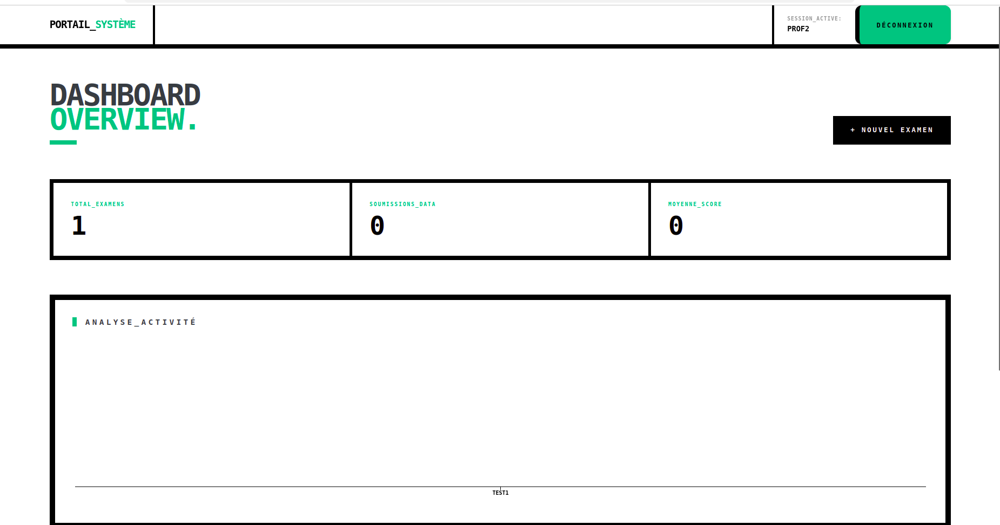
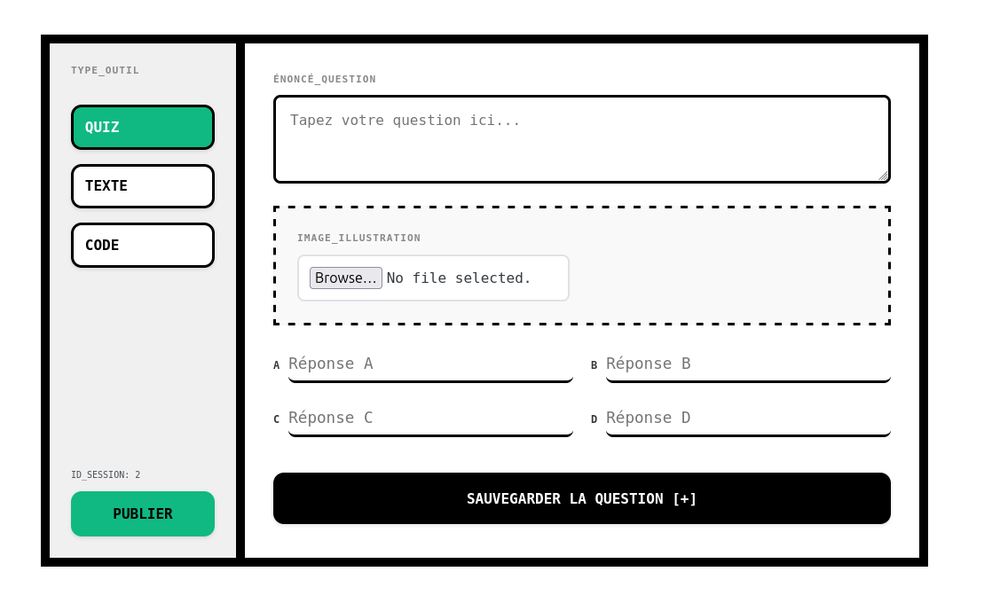
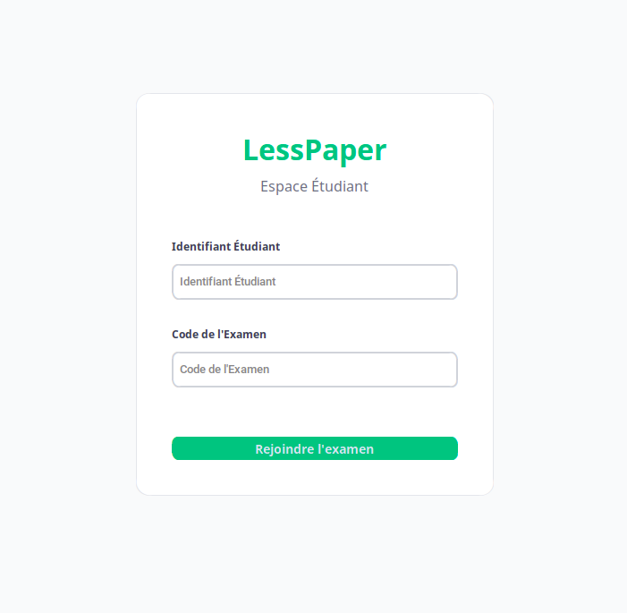

# LessPaper

LessPaper is a full-stack digital examination system designed to replace traditional paper-based coding exams with a secure, monitored, and scalable digital environment.

The platform combines a FastAPI backend, a React-based instructor dashboard, and a Python desktop application with a custom-built anti-cheat “Kiosk Mode” system.

It was built to modernize academic assessment workflows while maintaining exam integrity.
# Key Features
1. Anti-Cheat Kiosk Mode
Locks the workstation in fullscreen, prevents app switching, and blocks exit shortcuts until submission.

2. Secure Coding Environment
Dedicated code editor interface for structured exam responses.

3. Instructor Analytics Dashboard
Real-time monitoring tools and activity visualization.

4. Dynamic Multimedia Support
Exams can include images and diagrams served directly from the backend.

5. Auto-Save Protection
Student answers are saved locally every 30 seconds to prevent data loss.

# System Architecture 

The project is organized into modular components to separate instructor administration from student execution:

    backend/: The FastAPI hub that manages the database and serves images.

    prof/profweb/: The React-based Teacher Portal for exam management.

    student/: The Python-based Desktop environment for students.
                ┌─────────────────────┐
                │  React Teacher Portal│
                │     (prof/profweb)  │
                └──────────┬──────────┘
                           │
                           ▼
                ┌─────────────────────┐
                │     FastAPI API     │
                │      (backend)      │
                └──────────┬──────────┘
                           │
                           ▼
                ┌─────────────────────┐
                │  Student Desktop App│
                │      (Python)       │
                └─────────────────────┘

# Screenshots
# Teacher Dashboard


# Student Exam Interface
 


# Launch Instructions (Step-by-Step)

To run the entire project, you must open three separate terminals and follow this exact order:
1. Start the Backend (API Server)

The backend must be running first so the interfaces can connect to the database.
Bash

cd backend
# Activate your virtual environment
source venv/bin/activate  # Windows: venv\Scripts\activate
# Start the server using Uvicorn
uvicorn main:app --reload

The API will be available at http://localhost:8000.
2. Start the Teacher Web Portal
Bash

cd prof/profweb
npm install       # Only needed the first time
npm run dev

Access the dashboard at http://localhost:5173.
3. Launch the Student Application
Bash

cd student
source venv/bin/activate
python lesspaper.py

# Tech Stack
Backend

FastAPI

Uvicorn

Python

SQLite / (replace if different)

Teacher Portal (Frontend)

React

Vite

JavaScript

(Add any chart library if used)

Student Application

Python

Tkinter / CustomTkinter

Custom anti-cheat module
# Anti-Cheat Security (Kiosk Mode)

The anticheat.py module enforces academic integrity through:

    Native Fullscreen: Overrides window decorations to cover the entire screen.

    Topmost Window: Keeps the application above all other system windows.

    Focus Capture: Automatically re-claims focus if the student tries to switch apps.

    Close Prevention: Blocks exit commands like Alt+F4 until the exam is submitted.


# Project Structure
```plaintext
lesspaper/
├── backend/              # FastAPI Server & Database
│   ├── static/           # Uploaded exam images
│   └── main.py           # API entry point
├── prof/
│   └── profweb/          # React Instructor Dashboard
├── student/
│   ├── lesspaper.py      # Main UI & application logic
│   ├── anticheat.py      # Kiosk Mode implementation
│   └── submissions/      # Local auto-save drafts
├── requirements.txt
├── install_dependencies.sh
└── README.md


